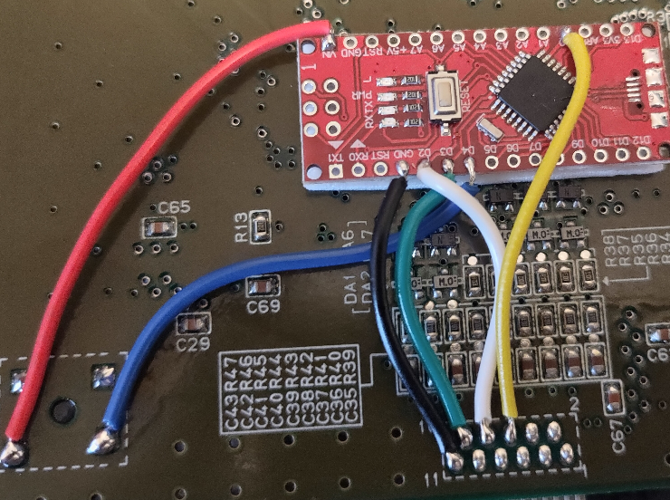

# Atmega-SNES-IGR
In Game RESET for SNES / Super Famicom using arduino 168P / 328P

## Reset combination L + R + SEL (instant reset) Developed on a cheap clone!

##  6 wires 

  - 5v to VIN (grabbed it off live side of reset)- 
  - D4 to Low/ idle side of reset
  - D3 to controller latch
  - D2 to controller clock
  - A0 (19/PC0) to Controller serial.
  - Gnd to Ground

 # How's it work?

The app counts clock pulses during latch pulses.
On each clock pulse during a latch pulse the app 
checks the state of the serial line. The serial 
line idles high and is pulled low with a button press.
Each clock pulse during a latch pulse corresponds to
a different button being pressed.

Between latch pulses the app checks which clock
pulses had the serial line pulled low during that 
clock pulse. 

It's not 100%. I was going to use Start as part 
of the combo but adding any code drops that bit being
ccaptured. There could be a a few early buttons 
missing but it wasn't worth coding around. It took a few 
hours to write.

Issue found: 8BitDo Bluetooth dongle when pairing with controller after a disconnect will trigger the combo when using an 8bitDo Pro2 controller (and possibly others...?)

I'd like to rewrite this to clear and write bits of a 16bit data type for the button inputs, then reference this against the value of a reset combo instead of using 3 bools.

This would allow the reset combo to trigger only when the 3 buttons are pressed, if there was a 4th or 5th pressed it wouldn't trigger.

This could help, i suspect the dongle temporarily presses every button down simulataneously on connection.

It doesn't cause issues, but if you were playing , then paused, walked away long enough to let the controller self power off, then reconnected, you'd get a reset.
